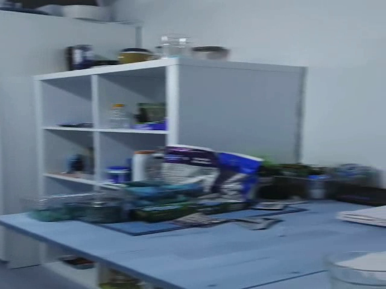

# Video-Inpainting-with-Diffusion-Model
A prototype of a video conversion process that can convert SD videos to HD videos using diffusion (image to image, Inpainting) type models, while preserving the context of the video and being efficient.

## Overview

Video inpainting is a process that involves replacing or editing specific areas of a video. This technique is particularly valuable for image restoration, such as removing defects, artifacts, or replacing selected portions of the video with new content. In this project, we leverage a diffusion model for inpainting, a method that utilizes a mask to identify the regions of interest in the video. The inpainting process is guided by the mask, with white pixels indicating the areas to be filled in and black pixels representing the areas to be preserved.

## How It Works

1. **Mask Definition:** A mask is used to specify the regions in the video that require inpainting. White pixels in the mask correspond to the areas to be filled in, while black pixels define the areas that should remain unchanged.

2. **Inpainting Process:** The inpainting algorithm processes the video frame by frame, filling in the white pixels according to a predefined prompt. This prompt can be customized based on the requirements of the inpainting task.

3. **Output:** The result is a video where the specified regions have been seamlessly inpainted, creating a visually coherent and restored output.

# Stable Diffusion
Stable Diffusion is a latent text-to-image diffusion model.
Thanks to a generous compute donation from [Stability AI](https://stability.ai/) and support from [LAION](https://laion.ai/), we were able to train a Latent Diffusion Model on 512x512 images from a subset of the [LAION-5B](https://laion.ai/blog/laion-5b/) database. 
Similar to Google's [Imagen](https://arxiv.org/abs/2205.11487), 
this model uses a frozen CLIP ViT-L/14 text encoder to condition the model on text prompts.
With its 860M UNet and 123M text encoder, the model is relatively lightweight and runs on a GPU with at least 10GB VRAM.

  
  
<strong>Stable Diffusion Architecture</strong>

## Getting Started

### Prerequisites

- It is requested to run the file in Google Collab with GPU selected at runtime and input video uploaded

## Results
### Adding Mask 
 

